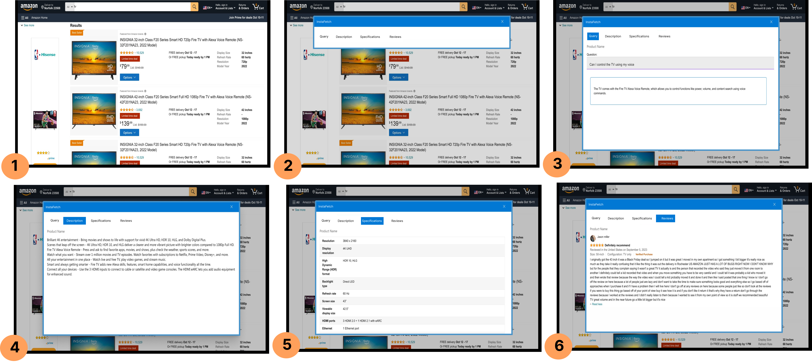

# InstaFetch 2024

## Abstract

Perusing web data items such as shopping products is a core user activity in online e-commerce transactions. To prevent information overload and visual clutter, the content associated with these data items is typically dispersed across multiple webpage sections over multiple web pages in the websites. However, such distributed arrangement of content manifests an unintended side effect of significantly increasing the interaction time, effort, and frustration for blind users, since navigating to-and-fro between different sections in different pages is tedious and cumbersome with their go-to assistive technology, namely a screen reader. While existing works have proposed different ways to address this problem in the context of a single webpage, solutions enabling usable access to content distributed across multiple webpages are few and far between. 
%
In this paper, we present InstaFetch, a browser extension that dynamically generates an alternative screen reader-friendly user interface in real-time, which blind users can leverage to almost instantly access different item-related information such as description, full specification, and user reviews, all in one place, without having to tediously navigate to different sections in different webpages. Moreover, InstaFetch also supports natural language queries about any item, a feature blind users can exploit to quickly obtain desired information, thereby avoiding manually trudging through reams of text.
%
In a study with 14 blind users, we observed that within a given time frame, the participants needed significantly lesser time to peruse data items with InstaFetch, than with both their status quo screen reader and a state-of-the-art solution.

## InstaFetch Illustration

 

